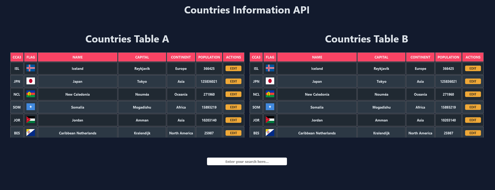

# Test 14022023

## Functions
- Download from the API all the informative data of each country.
- Serialization of the data to adjust them to the views prepared for them.
- Edition of some data, with cross refresh of the same, which allows all the components to be updated with the same information.
- Predictive data search, which allows filtering by cca3 code and country name, for all context-dependent components.

## Features

- Web app developed in ReactJS
- Using Reducers, Contexts and Custom Hooks
- CSS style sheets
- Functional separation of components
- Centralization of data through a store accessible to each component wrapped within a context provider
- -No styling and state handling frameworks are used. The only library installed is Axios to avoid the complexity of the promises of the native javascript api "fetch".

## License
Does not require a license

## Caution
This is a test repository, for a technical interview without any kind of commercial purpose. The use or misuse of it is the responsibility of each person. The information shown here is consumed from a free third-party API that does not require APIKEY.

**DevNica**

